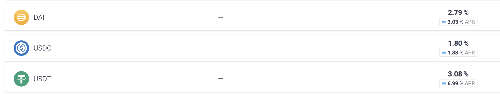
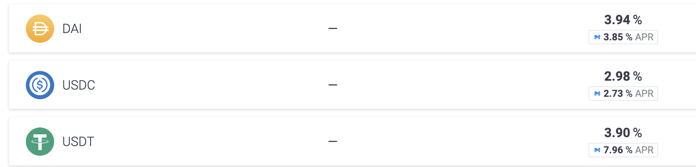
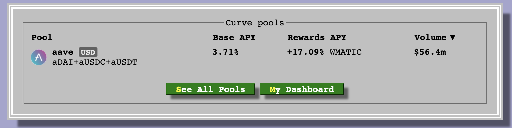
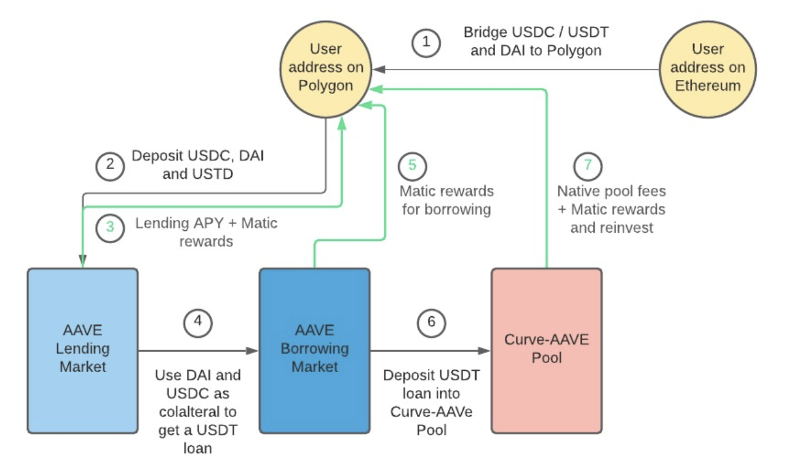

# Polygon-AAVE Strategy

## The Bounty

We have created this guided bounty where developers can participate by automating the strategy we detail below. The idea is that developers take the strategy and automate it by building smart contracts that facilitate programmatically yield farming of this strategy.

### The context

The yield farming program is a liquidity mining program for MATIC rewards, and it is used to attract deposits into Aave. Depositors can lend out their crypto assets while borrowers who are looking to borrow these assets can do so as well.

Polygon is giving out MATIC rewards so people are incentivised to participate in their network. The supported markets are AAVE, DAI, ETH, MATIC, USDC, USDT, and WBTC.

## Resources

### How to Deploy a smart Contract on the Polygon Test Network

[This guide](https://docs.matic.network/docs/develop/remix/) will show you how to deploy a smart contract on the Polygon network leveraging Metamask and the IDE Remix. It's useful if you don't have any experience with Polygon or Solidity.

### Solidity smart contract IDE and debug tools

A [quick list](https://medium.com/stakingbits/guide-to-yield-farming-with-aave-on-polygon-matic-network-a03bd2154275) of the development tools that you can leverage. We recommend however the setup described above.

### Aave Docs

- [How to interact with the Lending Pool](https://docs.aave.com/developers/the-core-protocol/lendingpool) so you can deposit, borrow, withdraw and more.
- [List of deployed contracts](https://docs.aave.com/developers/deployed-contracts/matic-polygon-market)

### Other Polygon Resources

- Bridge tokens from Ethereum mainnet to Polygon using [Zapper Bridge](https://medium.com/stakingbits/guide-to-transferring-tokens-from-ethereum-to-polygon-using-zapper-bridge-163941ec8e10) or [Matic Bridge](https://medium.com/stakingbits/guide-to-using-the-matic-bridge-to-bridge-tokens-from-ethereum-to-polygon-c3e66cf3d334)
- [Bridge stablecoins from BSC to Polygon using xPollinate](https://medium.com/stakingbits/guide-to-using-the-xpollinate-cross-chain-bridge-for-bsc-polygon-transfers-9ebc4baedc34)
- [USDC bridging to Polygon using AscenDEX](https://medium.com/stakingbits/guide-to-cheap-usdc-bridging-to-polygon-using-ascendex-c02e57d59480)
- [Yield Farming on Aave on Polygon](https://medium.com/stakingbits/guide-to-yield-farming-with-aave-on-polygon-matic-network-a03bd2154275)

## **What makes a submission complete?**

- Link to a public Github repository containing the code, team members, presentations, demo and documentation
- Projects cannot be edited after submission.

## The Strategy

### 1. Bridge funds over to Matic

- Bridge some Matic to your address (for fees)
- bridge your stables (USDT, USDC, DAI)

### 2. Deposit funds on Matic via Aave

- Deposit stable coins into the Aave market
- DAI and USDC are used for collateral
- USDT cannot be collateralized but earns most deposit yield (%3.08+%6.99 in this case)
- You'll see why depositing into the USDT pool is advantageous even if you can't collateralize

### 3. Deposit yield

- Just by depositing you can earn up to 1.80-3.08% APY in native stable coin (as of June 8th, 2021)
- You also earn an additional 1.83-6.99% in Matic rewards
- So your total APR can be around 4-10% just for depositing
- Polygon allocated like 40-50M in rewards for these Aave pools
- Without borrowing you'll earn these rewards in real time

### 4. Earn by borrowing

Borrow Markets as of June 8th, 2021

- In borrowing markets, the variable borrow APR is the interest YOU have to pay additional to your loan
- The Matic % underneath is what Aave will pay YOU just to borrow
- for USDT you can earn 7.96% APR in Matic just by borrowing (you have to pay 3.90% APR however)
- Don't forget when you deposit as collateral you also earn.
- For USDT you earn 3.08+6.99%=10.07% APR to deposit as explained above
- You pay 3.90% and earn 7.96% APR to borrow, which makes you a 4.06% extra profit
- This for USDT only makes it a total APR of 10.07% for depositing and 4.06% for borrowing
- You're essentially getting paid a lot of Matic tokens to borrow on top of deposit

### 5. Define Borrow Strategy

- Let's say you deposit 20k into DAI, 20k into USDC, and 60k into USDT pools.
- You have 40k as collateral where I can borrow ~20k USDT.
- You are earning interest on 20k DAI, 20k USDC deposits and have 80k USDT (your original 60K which you deposited and the borrowed 20K)
- Instead of putting 100k to work, you are using 120k now
- So what do you do with the 20k USDT loan you just took out?

### 6. Deposit Borrowed USDT in CRV for Curve Rewards

- You can now deposit the 20k USDT into curve's platform and earn 3.71% in USDT + 17.09% APY in Matic! Yes, over 20%+ APY on your loan from CRV + the borrow interest you're already earning on AAVE.

### 7. Compound Rewards

- Now in DeFi, you get rewards instantaneously so you can claim your Matic at any time.
- You can either:

    a) add Matic to the matic pool on AAVE and earn an additional APR on that.
    b) swap for more stables and repeat the whole thing
    Fees are pennies on Matic!

## **Summary**

- Earn deposit interests on Aave
- Earn borrow interests on Aave
- Earn deposit interests on Curve
- Compound on Aave and Curve

## Winning Criteria

- Does the submission contain all steps mentioned in it?
- How high is the APY?
- How easy is it for a non-technical user to use this?
- How automated is the submission? Are there manual steps in-between?
- Are there creative additions that generate a higher APY?
- Are there any obvious security issues with the contracts?
- **Optional:** Does the submission have a frontend component? How usable is it?

## Judges

We have asked members of our community to participate as judges. They will use the criteria described above to rank all submissions. We will announce the winners shortly after the submission deadline.
